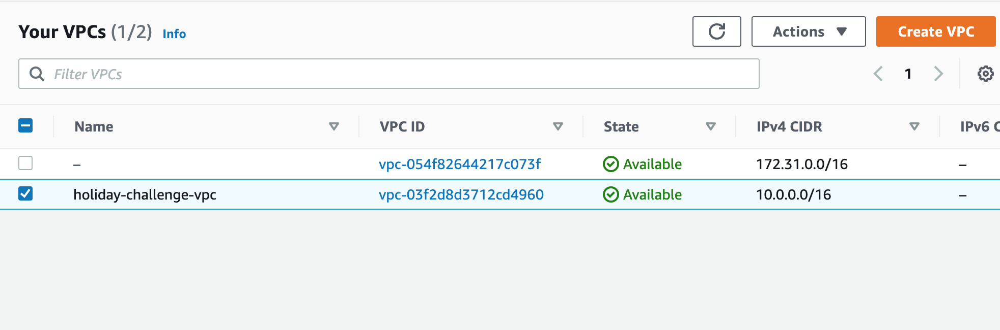
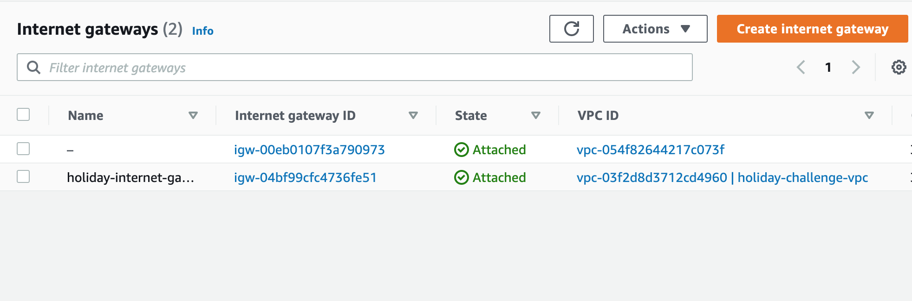
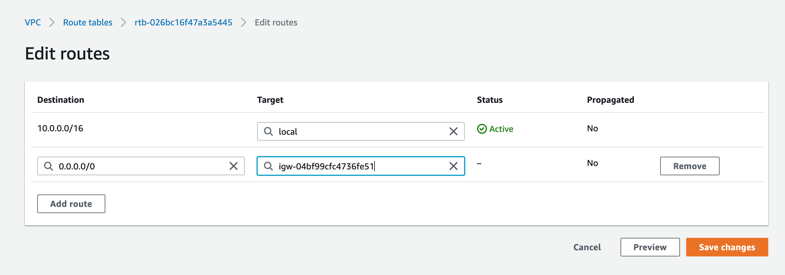
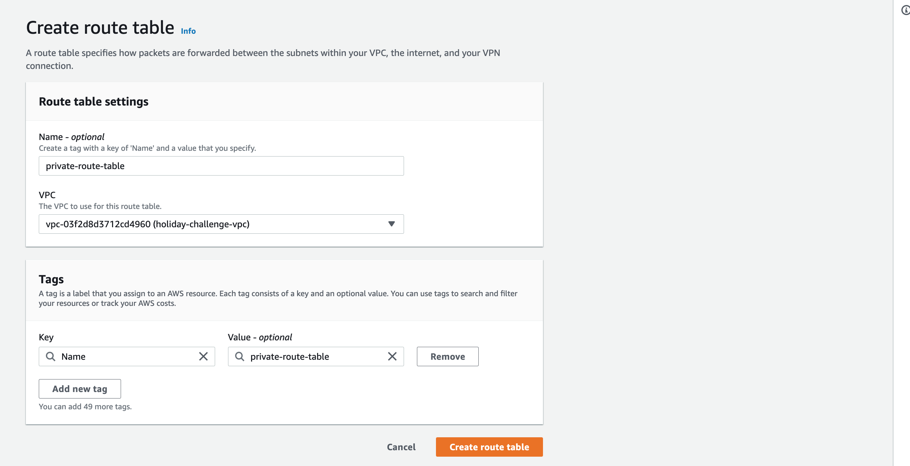
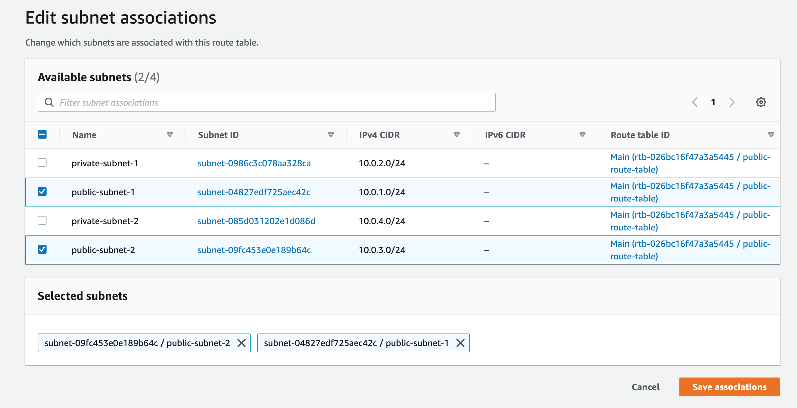
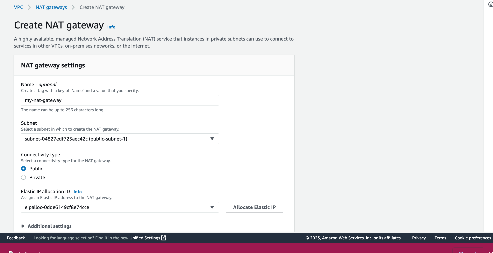
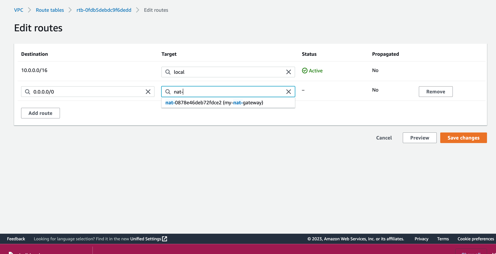

# Setting up a Load Balancer in a VPC in AWS- Infrastructure.

## Project Overview
The aim of this project is to explore the function of a load balancer (application load balancer) and it's set up in an AWS VPC.

To fully understand the task, there is a need to define some of the services that will be deployed to achieve the aim of the project.

## AWS services needed for the task.

### VPC
According to the instruction given, the resources are to be provisioned in a private logical network. Traditionally, resources are usually deployed in a data center belonging to a particular organization. So in the cloud, for example, AWS, resources needed by an organization are usually deployed within a defined private network. AWS Virtual Private Cloud (AWS VPC) allows us to define a private network where resources can be deployed.

#### Things to note about a VPC:
1. It belongs to a region in AWS. By default, Amazon has VPC in every region that you can connect with, however, you can create one by yourself.
 
2. You can have more than one VPC in a region.
 
3. You can create multiple subnets in a VPC.
 
4. All availability zones present in a region can be accessed in one VPC.
 

## Steps taken for the task
### 1. VPC Creation:
Create a VPC and gave it a name tag.  

Note that by default, a VPC is private and not accessible to the internet by default.
 

### 2. Subnet Creation:
Create subnets in your Availability Zones (AZ), in this case, I am creating four. Two (one public and one private) subnets in two Availability Zone.
 

### 3. Internet Gateway Creation:
Create an Internet Gateway (igw) and map it to the VPC. Note that an internet gateway's function is to allow internet access to all the resources in the VPC. Every VPC has only one and it makes it possible for the resources deployed in the VPC have access to the internet (the public). 

 

### 4. Route Table Creation:
Create a Route table and associate them with subnets. By default, when subnets are created in a VPC, they are not accessible to the internet, they are private. What completes the process of making your subnet public is by setting rules that will direct traffic from within the VPC to the internet gateway.

By default, a route table is created alongside every VPC and it routes all traffic within a VPC. We can however edit this routing table and add another rule to direct all those traffic to the internet gateway. 

For private subnets, we will create a new route table and associate it with the private subnet. Keeping in mind that all traffic coming from the resources in the private subnet are already routed locally.

Route tables operate at subnet levels. This means that you need to specify which subnet you want to work with the route table. This is what actually defines whether a subnet is public or private.

Note that you can edit the default route table created to make it public by adding new rules and giving it a name or creating a new one entirely. For any new route table you create, you will always find your VPC traffic routed locally.

### 5. NAT Gateway Creation:
Network Address Translation gateway enables resources deployed into the private subnets to have access to the internet. It helps to keep the private subnet private by not allowing any inbound traffic from outside to reach the subnet resources but allows network connection from inside the subnet to the outside world.

Instances in a private subnet will usually have a private IP address that doesn't allow them access to the internet. But with a NAT gateway that will have an Elastic public IP attached to it, you can map the private addresses of your instances to it so that all requests meant for the internet from your instances are carried out through that route.

Therefore, if you have a predefined script such as a userdata that can run on an instance at the point of creation, your NAT gateway will create the internet connection for it to run smoothly.

Note that you need an elastic IP for the creation of a NAT gateway. If you don't have one you have created, you can simply click on allocate elastic IP on the NAT gateway creation page.

### 5. Adding NAT Gateway to the Private-Route-Table:

Recall that from our previous private-route-table set up, our traffic within the subnet wasn't routed to the internet. To direct the traffic to the outside world, we have to include a new rule in the route table as seen below:

## Summary
With these steps, we have been able to configure the infrastructural resources for setting up our load balancer and the EC2 instances in our private network.

## Resources:
https://hexquote.com/aws-internet-gateway-and-vpc-routing/