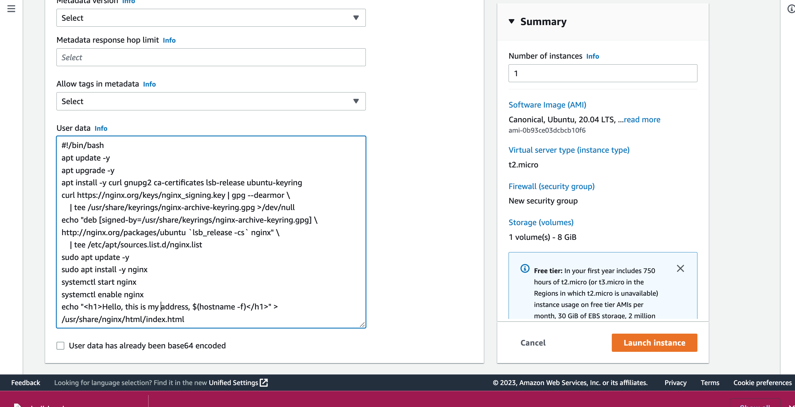
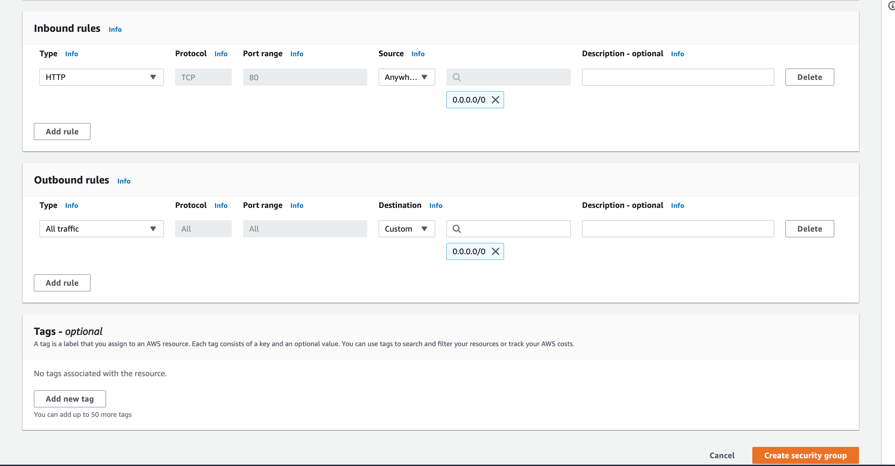
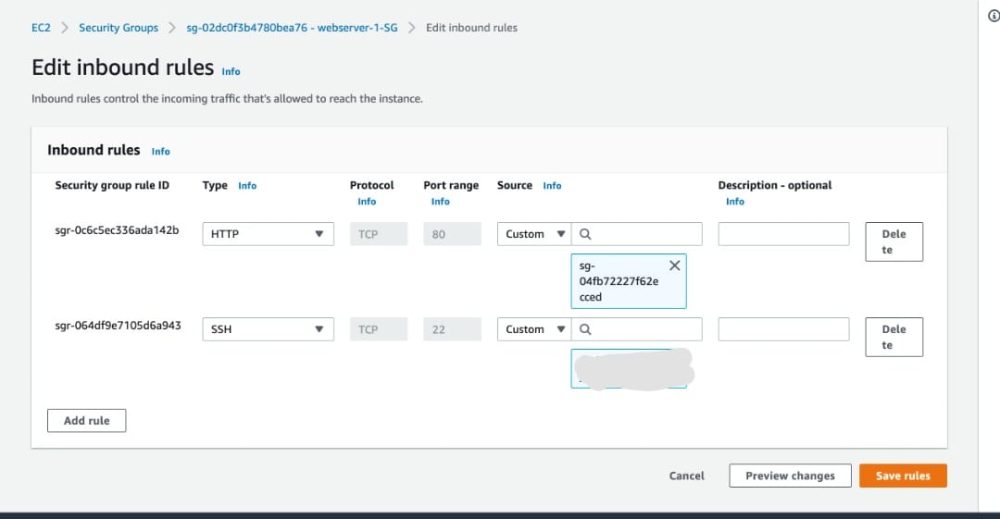
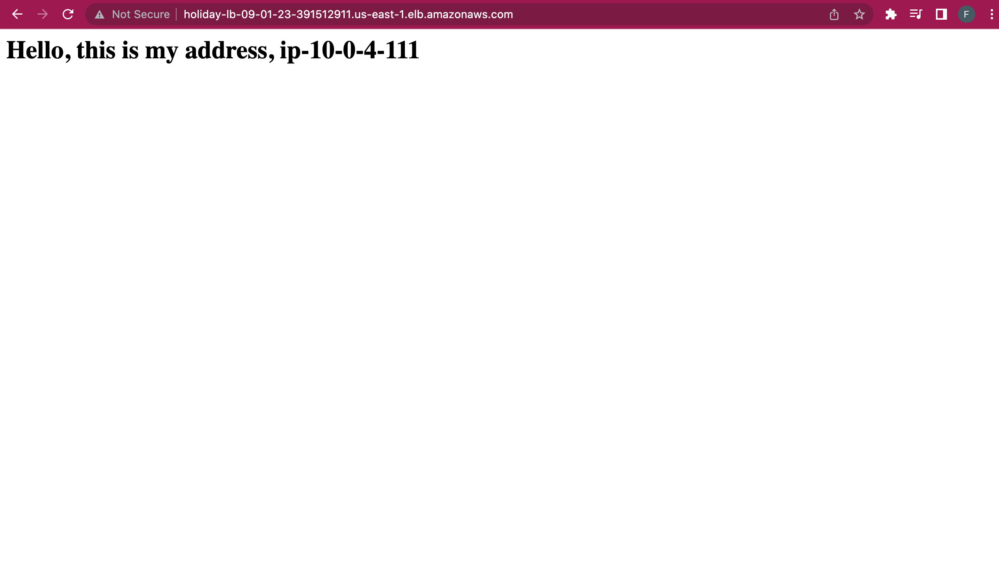
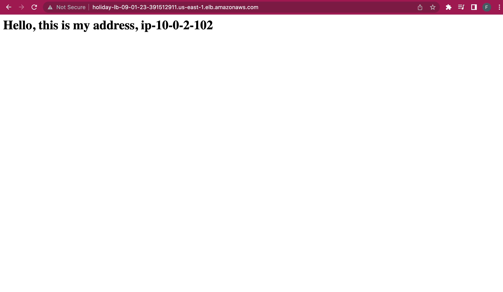
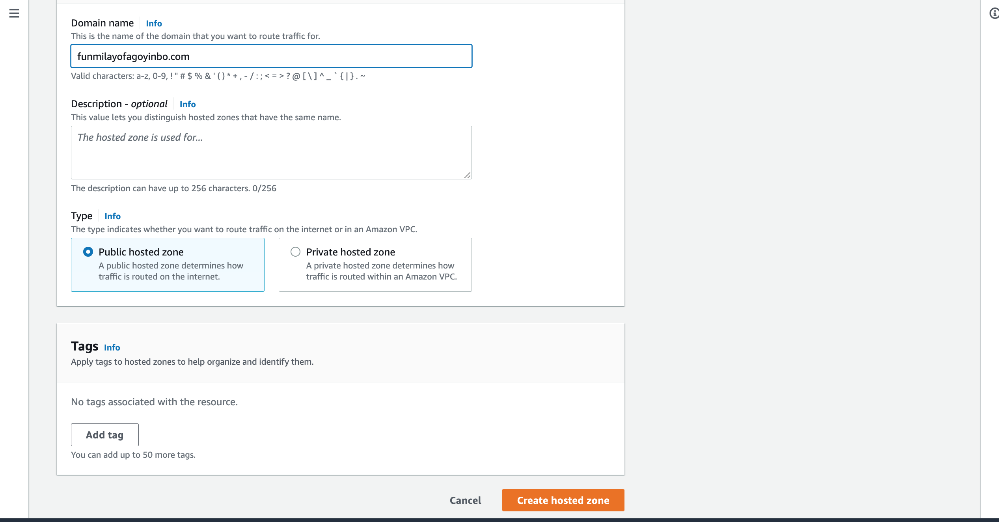
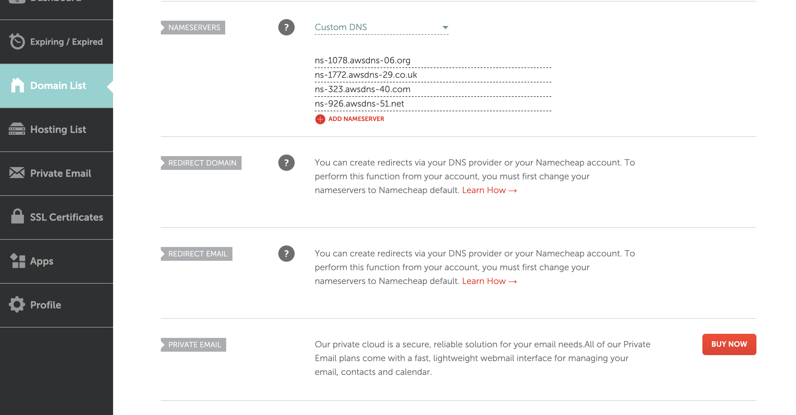
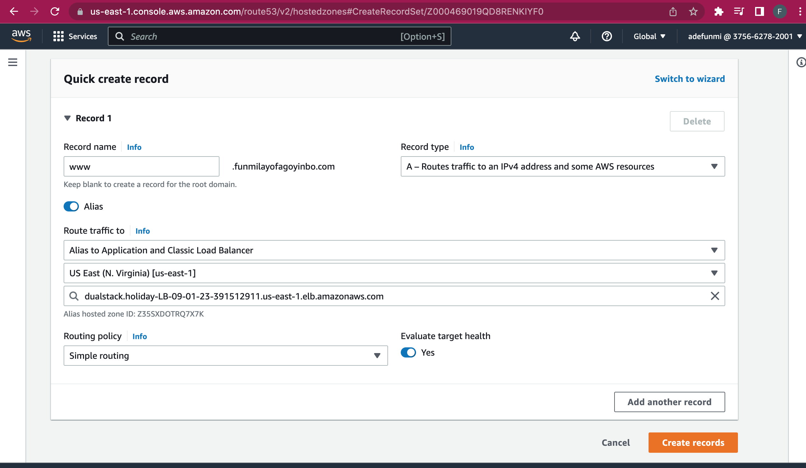
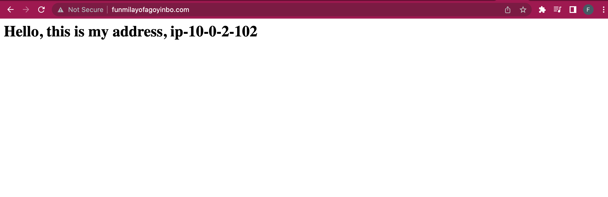

# Setting up a Load Balancer in a VPC in AWS- Resources.

After we have set up the infrastructure in the VPC, the next thing is to create our resources on them.

## Steps to deploy our resources.

### 1. EC2 Instances Creation:
Here, we will be launching our two instances in the private subnets we created earlier on. We will also generate a new ssh key to connect our instances and edit the network settings to enable us choose the VPC and subnets we want them in.

For the Security group setting, I will be allowing ssh connection from My IP which will be automatically generated when you pick the option. We can't add a rule to allow traffic from the load balnacer yet because we haven't created it yet.

I will also be working with a script that would update the ubuntu repo, install all the nginx dependencies, and display the hostname of the VM by editing the index.html file.

```
#!/bin/bash
apt update -y
apt upgrade -y
apt install -y curl gnupg2 ca-certificates lsb-release ubuntu-keyring
curl https://nginx.org/keys/nginx_signing.key | gpg --dearmor \
    | tee /usr/share/keyrings/nginx-archive-keyring.gpg >/dev/null
echo "deb [signed-by=/usr/share/keyrings/nginx-archive-keyring.gpg] \
http://nginx.org/packages/ubuntu `lsb_release -cs` nginx" \
    | tee /etc/apt/sources.list.d/nginx.list
sudo apt update -y
sudo apt install -y nginx
systemctl start nginx
systemctl enable nginx
echo "<h1>Hello, this is my address, $(hostname -f)</h1>" > /usr/share/nginx/html/index.html
```
<br>



After launching the first instance, create another instance and select the existing Security Group you created for the first one, the ssh key and lauch the instance.

### 2. Application Load Balancer Creation:
We are using an Application Load Balancer for this task. We will map its network to our availability zones and pick the public subnets as where we want it to be.

We also need to create a security group for the Load Balancer to allow HTTP requests from anywhere.



We will also create a target group that will comprise the instances in the private subnet.

After creating the load balancer, we can then edit the security group asociated with the virtual machines and we will add another rule to the inbound rules that allows HTTP traffic from the load balancer.



### 3. Checking for successful configuration:

After setting, to check if the configuration is successful, we will check the target group to see that the instances are healthy. We can then access the websites with the provisioned DNS provided by AWS for the load balancer.

When you refresh the page, the load balancer will toggle between the two websites as shown below:





### 4. Mapping my NameCheap Domain to the load balancer.

On hosted zone dashboard of Route 53, I created a hosted zone with the domain name as shown below:


This created NS and SOA records. The four Value/Route Traffic to input were copied into the custom DNS nameservers of the said domain name on Namecheap as shown:



Then, on the hosted zone of the domain name on route 53 dashboard, We will click on create record.
We will fill the form as shown below:



After creating the record, you can visit the recorded name with www to access the load balancer. 

This is what I have using my domain name.





## Resources
http://nginx.org/en/linux_packages.html#Ubuntu
https://hexquote.com/aws-elastic-compute-cloud-ec2-basics/
